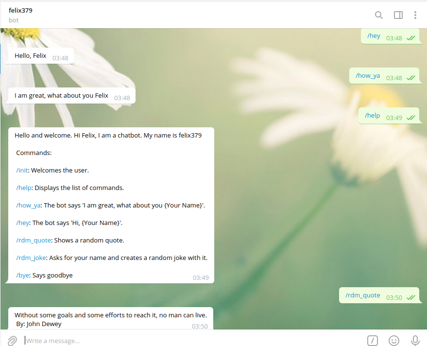
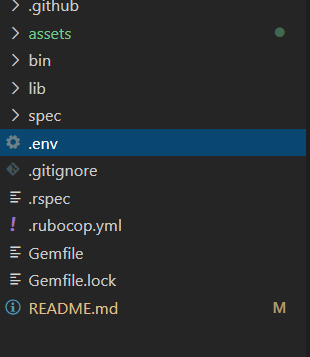

# Telegram_bot



> In this project, I built a telegram bot that can be initialized from the command line. It is a relatively simple bot that displays text messages based on the commands entered by the user.

## What this bot does

- It can interact with the user when the user enters "/hey" or "/how_ya" commands
- It displays a random joke with your name in it 
- It can also display a random motivational quote 


### Acceptable commands

```console
/help 
```

```console
/hey
```

```console
/how_ya
```

 ```console
/init
```

 ```console
/bye
```

 ```console
/rdm_quote
```

 ```console
/rdm_joke
```

## Built With

- Ruby
- Telegram Bot API
- Type fit Quotes API
- Chuck Norris Jokes API


### Requirements
- A desktop or laptop computer
- Ruby. [Installing Ruby](https://www.ruby-lang.org/en/documentation/installation/)
- A telegram account
- A telegram Chat bot API (the long number given when you create a new bot)

### Getting Started

- Get a local copy of this repo
  Open a terminal and run:```git clone git@github.com:felix-vondee/telegram_bot.git```
- Navigate to your telegram account if you have one. Or create new telegram account.
- Create a new bot with the help of [BotFather](https://t.me/botfather)
- Obtain your new bot's token.
- Create .env file in the root directory.
- Insert the folowing snippet inside your .env file: ```TELEGRAM_API = Paste your ChatBot API Here```

  

- Open a terminal and run ```bundle install```
- After successful installation, run the command ```ruby bin/main.rb```

- On your telegram account search for your bot's name

- Then use the commands above to begin interacting with the bot

## Dependencies

- telegram-bot-ruby
- dotenv
- httparty


## Testing

- Install Rspec on your system

- Open Command Prompt or Terminal and run: ```gem install Rspec```

- Navigate into the project folder and run the following command in the console: ```rspec```


## Contributor

👤 **Felix Vondee**

- Github: [@felix-vondee](https://github.com/felix-vondee)
- Twitter: [@felix_vondee](https://twitter.com/felix_vondee)
- Linkedin: [Felix Vondee](https://www.linkedin.com/in/felix-vondee-b8a280202/)

## 🤝 Interested in contributing ?

Contributions, issues and feature requests are welcome!
Feel free to check out the [issues page](https://github.com/felix-vondee/telegram_bot/issues).

## Show your support

Drop a ⭐️ if you like this project!
